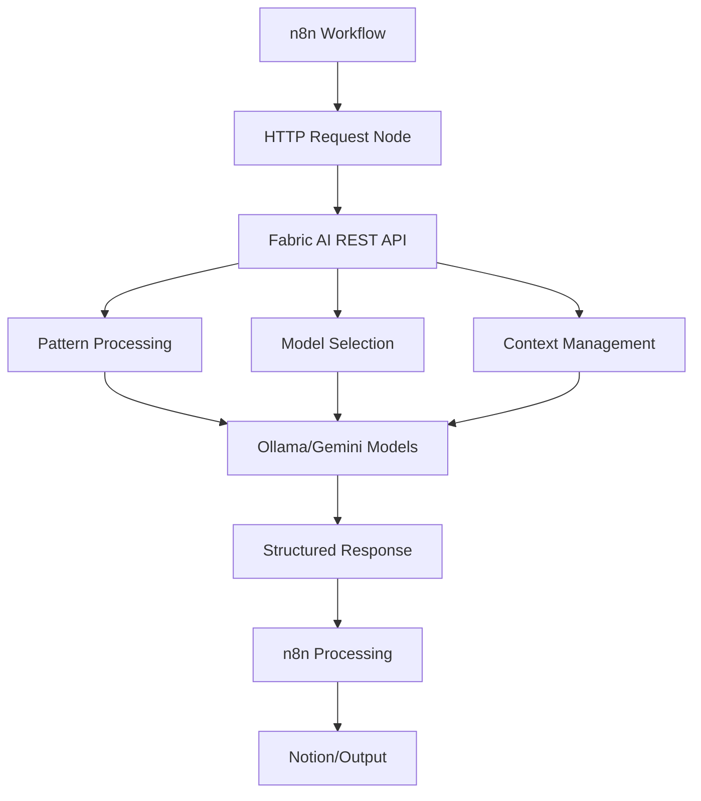
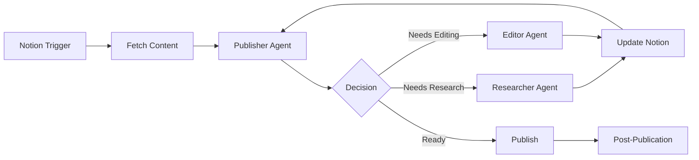
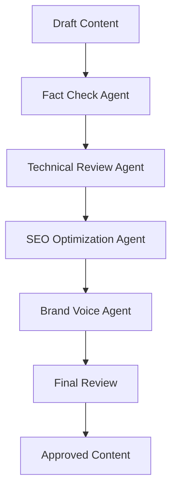

# Fabric AI Tool for n8n - Complete Integration Guide

## Overview

This guide provides a complete framework for integrating Fabric AI with n8n workflows to create powerful AI agents for content creation, automation, and intelligent processing. Fabric AI acts as your local AI powerhouse, providing patterns, models, and structured AI interactions through a REST API.

## What is Fabric AI?

Fabric AI is an open-source framework that augments humans using AI. It provides:
- **Patterns**: Pre-built prompts for specific tasks (summarize, analyze, extract_wisdom, etc.)
- **Models**: Support for multiple AI models (Ollama local models, Gemini, OpenAI, etc.)
- **Contexts**: Conversation memory and state management
- **Sessions**: Persistent chat sessions
- **Strategies**: Meta-prompting approaches for complex reasoning

## Architecture Overview



## Connection Configuration

### Base Settings

- **Host**: `https://fabric-ai.rohi.life`
- **Authentication**: API Key required (X-API-Key header)
- **Content-Type**: `application/json`
- **Method**: `POST`
- **Primary Endpoint**: `/chat`

### Environment Variables

```properties
FABRIC_API_KEY=Pluh8-Smiss9-Bop2-Tit1-Glesk3-Snund7-Clint7-Stod3
FABRIC_BASE_URL=https://fabric-ai.rohi.life
```

## Core API Usage

### Basic Request Structure
```json
{
  "prompts": [{
    "userInput": "Your content here",
    "model": "llama3.1:8b",
    "patternName": "summarize",
    "contextName": "",
    "strategyName": "",
    "variables": {}
  }],
  "temperature": 0.7,
  "top_p": 1.0,
  "frequency_penalty": 0.0,
  "presence_penalty": 0.0,
  "language": "en"
}
```

### Available Endpoints
- `GET /patterns/names` - List all available patterns
- `GET /models/names` - List available AI models
- `POST /chat` - Main interaction endpoint
- `GET /contexts/names` - List conversation contexts
- `GET /sessions/names` - List active sessions

## AI Agent Roles and Prompts

### 1. Publisher Agent
**Role**: Content strategy and final approval
**Prompt Template**:
```
You are a Publisher AI Agent responsible for content strategy and quality control.

CONTEXT: {{notion_content}}
CURRENT_STATUS: {{blog_status}}

TASKS:
1. Evaluate content quality and completeness
2. Identify missing information or research needs
3. Assign tasks to researcher and editor agents
4. Make final publication decisions

DECISION_FRAMEWORK:
- Content accuracy: Verify facts and claims
- SEO optimization: Check keywords and structure
- Brand voice: Ensure consistency with style guide
- Reader value: Assess usefulness and engagement

OUTPUT_FORMAT:
{
  "status": "needs_research|needs_editing|ready_to_publish|published",
  "tasks": [
    {
      "agent": "researcher|editor",
      "task": "specific task description",
      "priority": "high|medium|low"
    }
  ],
  "feedback": "detailed feedback for improvements",
  "publish_decision": "approve|reject",
  "next_steps": "clear action items"
}
```

### 2. Researcher Agent
**Role**: Fact-checking and data enrichment
**Prompt Template**:
```
You are a Researcher AI Agent specialized in technical fact-checking and data enrichment.

RESEARCH_REQUEST: {{publisher_task}}
CONTENT_DRAFT: {{current_content}}
TOOLS_AVAILABLE: Firecrawl, SearxNG, Web Search

RESEARCH_METHODOLOGY:
1. Identify claims requiring verification
2. Search for authoritative sources
3. Cross-reference multiple sources
4. Flag outdated or incorrect information
5. Suggest additional relevant data

VERIFICATION_STANDARDS:
- Primary sources preferred
- Recent data (within 12 months for tech topics)
- Authoritative publications and documentation
- Official vendor documentation for technical details

OUTPUT_FORMAT:
{
  "verified_facts": [
    {
      "claim": "original claim",
      "status": "verified|disputed|outdated",
      "sources": ["source URLs"],
      "updated_info": "corrected information if needed"
    }
  ],
  "additional_data": [
    {
      "topic": "relevant topic",
      "data": "new information found",
      "sources": ["source URLs"],
      "integration_suggestion": "how to incorporate"
    }
  ],
  "research_confidence": "high|medium|low",
  "recommendations": "suggestions for content improvement"
}
```

### 3. Linguistic Editor Agent
**Role**: Language, style, and readability optimization
**Prompt Template**:
```
You are a Linguistic Editor AI Agent focused on clarity, style, and engagement.

CONTENT_TO_EDIT: {{content_draft}}
STYLE_GUIDE: {{brand_style_guide}}
TARGET_AUDIENCE: {{audience_profile}}

EDITING_PRIORITIES:
1. Clarity and readability
2. Brand voice consistency
3. Grammar and syntax
4. Flow and structure
5. Engagement optimization

STYLE_REQUIREMENTS:
- Tone: {{desired_tone}}
- Reading level: {{target_reading_level}}
- SEO keywords: {{keywords_list}}
- Content format: {{format_requirements}}

OUTPUT_FORMAT:
{
  "edited_content": "fully edited version",
  "changes_summary": [
    {
      "type": "grammar|style|clarity|structure",
      "original": "original text",
      "revised": "revised text",
      "reason": "explanation for change"
    }
  ],
  "readability_score": "score and assessment",
  "seo_optimization": {
    "keyword_density": "analysis",
    "suggestions": ["SEO improvements"]
  },
  "final_recommendations": "additional suggestions"
}
```

## n8n Node Configurations

### 1. HTTP Request Node for Fabric AI

**Base Configuration:**
```javascript
{
  "method": "POST",
  "url": "https://fabric-ai.rohi.life/chat",
  "authentication": "none",
  "headers": {
    "Content-Type": "application/json",
    "X-API-Key": "={{$env.FABRIC_API_KEY}}"
  },
  "body": {
    "prompts": [{
      "userInput": "={{$json.content}}",
      "model": "={{$parameter.model || 'llama3.1:8b'}}",
      "patternName": "={{$parameter.pattern || ''}}",
      "contextName": "={{$parameter.context || ''}}",
      "strategyName": "",
      "variables": {}
    }],
    "temperature": 0.7,
    "top_p": 1.0,
    "frequency_penalty": 0.0,
    "presence_penalty": 0.0,
    "language": "en"
  }
}
```

### 2. Publisher Agent Node
```javascript
{
  "method": "POST",
  "url": "https://fabric-ai.rohi.life/chat",
  "headers": {
    "Content-Type": "application/json",
    "X-API-Key": "={{$env.FABRIC_API_KEY}}"
  },
  "body": {
    "prompts": [{
      "userInput": "={{$json.notion_content}}\n\nStatus: {{$json.blog_status}}",
      "model": "gemini-2.0-flash-exp",
      "patternName": "analyze_content_strategy",
      "contextName": "publisher_context",
      "variables": {
        "brand_voice": "{{$env.BRAND_VOICE}}",
        "target_audience": "{{$env.TARGET_AUDIENCE}}"
      }
    }]
  }
}
```

### 3. Researcher Agent Node
```javascript
{
  "method": "POST",
  "url": "https://fabric-ai.rohi.life/chat",
  "headers": {
    "Content-Type": "application/json",
    "X-API-Key": "={{$env.FABRIC_API_KEY}}"
  },
  "body": {
    "prompts": [{
      "userInput": "Research task: {{$json.research_request}}\n\nContent: {{$json.content_draft}}",
      "model": "llama3.1:8b",
      "patternName": "research_and_verify",
      "contextName": "research_context",
      "variables": {
        "research_depth": "thorough",
        "source_quality": "authoritative"
      }
    }]
  }
}
```

### 4. Editor Agent Node
```javascript
{
  "method": "POST",
  "url": "https://fabric-ai.rohi.life/chat",
  "headers": {
    "Content-Type": "application/json",
    "X-API-Key": "={{$env.FABRIC_API_KEY}}"
  },
  "body": {
    "prompts": [{
      "userInput": "Content to edit: {{$json.content_draft}}",
      "model": "gemini-2.0-flash-exp",
      "patternName": "edit_content",
      "contextName": "editor_context",
      "variables": {
        "style_guide": "{{$env.STYLE_GUIDE}}",
        "target_tone": "{{$env.TARGET_TONE}}"
      }
    }]
  }
}
```

## Key Fabric Patterns for Content Automation

### Essential Patterns
- `summarize` - Create concise summaries
- `extract_wisdom` - Pull key insights from content
- `analyze_content` - Deep content analysis
- `create_blog_outline` - Generate blog structure
- `improve_writing` - Enhance prose quality
- `fact_check` - Verify claims and statements
- `seo_optimize` - Search engine optimization
- `create_social_posts` - Social media content
- `technical_review` - Technical accuracy check
- `brand_voice_check` - Brand consistency verification

### Pattern Usage Examples

**Content Summarization:**
```javascript
{
  "userInput": "{{$json.article_content}}",
  "patternName": "summarize",
  "variables": {
    "summary_length": "3_paragraphs",
    "focus": "key_takeaways"
  }
}
```

**SEO Optimization:**
```javascript
{
  "userInput": "{{$json.blog_content}}",
  "patternName": "seo_optimize",
  "variables": {
    "target_keywords": "{{$json.keywords}}",
    "content_type": "blog_post"
  }
}
```

## Workflow Templates

### 1. Complete Blog Automation Workflow



### 2. Content Quality Pipeline



## Advanced Features

### Context Management
Maintain conversation state across agent interactions:
```javascript
{
  "contextName": "blog_project_{{$json.blog_id}}",
  "userInput": "Continue working on the Azure security blog post...",
  "patternName": "continue_context"
}
```

### Session Persistence
Create persistent work sessions:
```javascript
{
  "sessionName": "content_creation_{{$now}}",
  "userInput": "Start a new content creation session for {{$json.topic}}",
  "patternName": "start_session"
}
```

### Variable Substitution
Dynamic content with variables:
```javascript
{
  "patternName": "create_content",
  "variables": {
    "topic": "{{$json.topic}}",
    "audience": "{{$json.target_audience}}",
    "tone": "{{$json.desired_tone}}",
    "keywords": "{{$json.seo_keywords}}"
  }
}
```

## Error Handling and Debugging

### Common Issues and Solutions

1. **Authentication Errors**
   - Verify API key in environment variables
   - Check X-API-Key header format
   - Ensure API key has proper permissions

2. **Model Not Available**
   - Check `/models/names` endpoint for available models
   - Verify model name spelling and case sensitivity
   - Ensure model is properly loaded in Fabric

3. **Pattern Not Found**
   - List patterns with `/patterns/names`
   - Verify pattern name matches exactly
   - Check if custom patterns are installed

4. **Response Timeout**
   - Increase n8n node timeout settings
   - Consider breaking large requests into smaller chunks
   - Monitor Fabric server performance

### Debugging Commands

```bash
# Test API connectivity
curl -H "X-API-Key: Pluh8-Smiss9-Bop2-Tit1-Glesk3-Snund7-Clint7-Stod3" https://fabric-ai.rohi.life/models/names

# Check pattern availability
curl -H "X-API-Key: Pluh8-Smiss9-Bop2-Tit1-Glesk3-Snund7-Clint7-Stod3" https://fabric-ai.rohi.life/patterns/names

# Test basic chat
curl -X POST https://fabric-ai.rohi.life/chat \
  -H "Content-Type: application/json" \
  -H "X-API-Key: Pluh8-Smiss9-Bop2-Tit1-Glesk3-Snund7-Clint7-Stod3" \
  -d '{"prompts":[{"userInput":"test","model":"llama3.1:8b"}]}'
```

## Performance Optimization

### Best Practices
1. **Model Selection**: Choose appropriate models for tasks
   - Gemini for complex reasoning
   - Llama for general content tasks
   - Smaller models for simple operations

2. **Batch Processing**: Group similar requests
3. **Context Reuse**: Maintain contexts for related operations
4. **Pattern Optimization**: Use specific patterns for better results
5. **Response Streaming**: Handle large responses incrementally

### Monitoring and Metrics
- Track API response times
- Monitor model performance
- Measure content quality scores
- Track automation success rates

## Security Considerations

### API Security
- Use strong, unique API keys
- Implement rate limiting
- Monitor API usage patterns
- Rotate keys regularly

### Content Security
- Validate AI-generated content
- Implement human review stages
- Monitor for sensitive data exposure
- Maintain audit logs

## Integration Examples

### WordPress Publishing
```javascript
// After Fabric processing
{
  "method": "POST",
  "url": "https://yoursite.com/wp-json/wp/v2/posts",
  "body": {
    "title": "={{$json.fabric_response.title}}",
    "content": "={{$json.fabric_response.content}}",
    "status": "draft"
  }
}
```

### Slack Notifications
```javascript
{
  "text": "New blog post ready for review: {{$json.title}}",
  "attachments": [{
    "title": "Quality Score: {{$json.quality_score}}",
    "text": "{{$json.summary}}"
  }]
}
```

## Conclusion

This Fabric AI integration transforms n8n into a powerful content automation platform. By leveraging AI agents with specific roles and responsibilities, you can create sophisticated workflows that maintain quality while automating repetitive tasks.

The key to success is:
1. **Clear agent roles** with specific responsibilities
2. **Structured prompts** that provide consistent outputs
3. **Proper error handling** for reliable automation
4. **Human oversight** for quality assurance
5. **Continuous optimization** based on results

Start with simple workflows and gradually add complexity as you become familiar with the patterns and capabilities.
