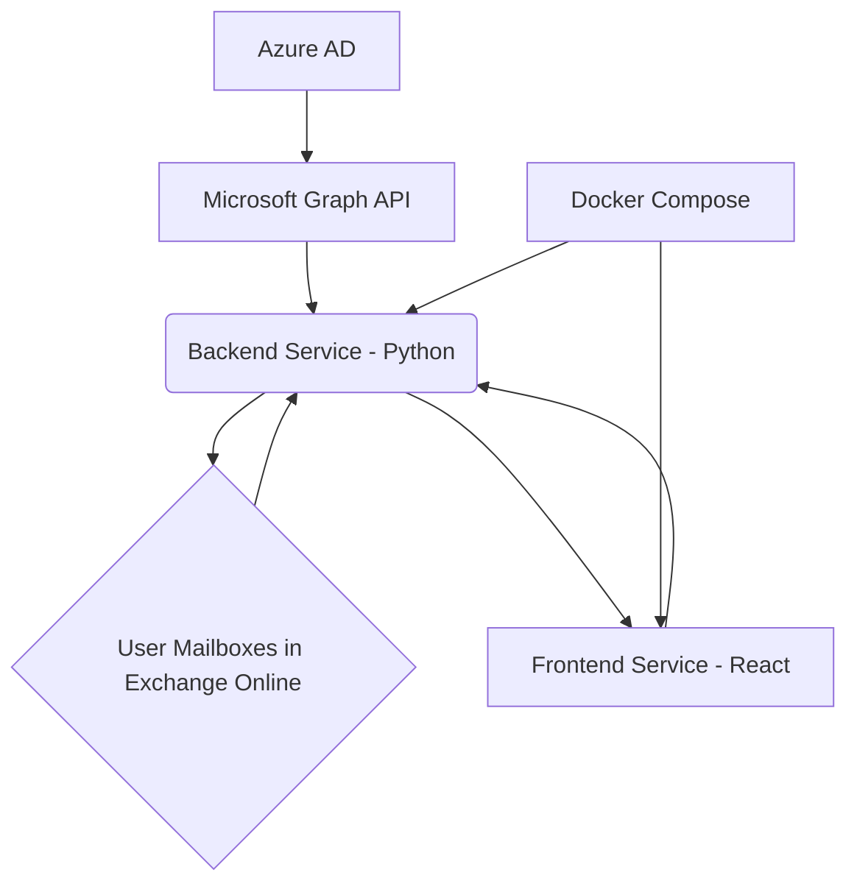

# Project Development Status - Gemini CLI Interaction

This document summarizes the current state of the `Sync_GAL` project and outlines the next steps for development, including the integration of the Gemini API.

## Objective

Generate a comprehensive project plan and architectural design for a containerized application that automates the synchronization of an organization's Global Address List (GAL) to individual users' Exchange Online contacts. This will ensure that all GAL contacts are visible and accessible on their mobile devices.

The automation will be managed via a front-end web interface and a back-end service, both running in containers. The back-end service will interact with the Microsoft Graph API using secure, certificate-based authentication.

## Current Project Status

The core project structure has been established, and the foundational components are in place:

*   **Project Setup:** Directories for `backend`, `frontend`, `docs`, and `secrets` are organized.
*   **Containerization:** Both the backend (Python) and frontend (React) services are Dockerized, with `docker-compose.yml` orchestrating their deployment.
*   **Microsoft Graph API Authentication:** The backend is successfully authenticating with the Microsoft Graph API using certificate-based authentication. Sensitive credentials (certificate, tenant ID, certificate thumbprint) are managed securely via Docker secrets.
*   **GAL User Fetching:** The backend script (`backend/src/main.py`) can successfully fetch all users from the Global Address List (GAL).
*   **Contact Fetching Logic (In Progress):** The script is currently being developed to:
    *   Iterate through each GAL user.
    *   Attempt to fetch existing contacts for each user, filtering by a custom extended property (`GAL_SYNC_PROPERTY_NAME`).
    *   Includes robust error handling for scenarios like mailboxes not enabled for REST API.
*   **Helper Tools:** A `helping_tools/generate_certificate.sh` script is available to generate self-signed certificates for Azure AD authentication.

## Where We Left Off

The last action taken was to update the `backend/src/main.py` script to correctly filter contacts using a custom extended property and handle mailbox-related errors.

**Before proceeding, you need to perform the following crucial step:**

*   **Update `GAL_SYNC_NAMESPACE_GUID`:** In the `backend/src/main.py` file, you must replace the placeholder `"YOUR_GENERATED_GUID"` with a unique, real GUID. You can generate one from websites like [https://www.guidgen.com/](https://www.guidgen.com/).

Once this GUID is updated, the next step will be to:

*   **Build and Run the Backend:** Execute `docker-compose build backend` followed by `docker-compose run --rm backend` to test the updated contact fetching and identification logic.

## Core Requirements

### 1. Authentication & Security

*   The back-end service must authenticate to the Microsoft Graph API using **OAuth 2.0 client credentials flow with a certificate**.
*   The application registration in Azure AD will require the following **Graph API permissions** (at the application level):
    *   `Contacts.ReadWrite`
    *   `User.Read.All`
*   All sensitive data, including the certificate's private key and tenant ID, must be stored securely using Docker Secrets.

### 2. Back-End Service (The Synchronization Engine)

This service will be the core of the automation. It should be designed as a stateless application, likely running on a schedule (e.g., a CRON job within a container).

**Key Logic and Checks to Implement:**

*   **Initial Fetch:**
    *   Fetch all relevant users from the GAL using the `/users` endpoint. Filter for active users with mailboxes.
    *   For performance, use the `$select` OData query parameter to retrieve only necessary fields (e.g., `id`, `displayName`, `givenName`, `surname`, `userPrincipalName`, `businessPhones`, `mobilePhone`, `jobTitle`, `department`).

*   **Contact Synchronization Logic (Per-User):**
    For each user in the organization, the script must perform the following actions against their personal contacts folder (`/users/{id | userPrincipalName}/contacts`):

    *   **Existing Contact Identification:**
        *   Before creating a new contact, you must check if a contact representing that GAL user already exists.
        *   **Best Practice:** When you create a contact for the first time, store the GAL user's immutable `id` (from Azure AD) in a custom property or in the `source` property of the contact object. This `id` will be the unique key for future lookups, updates, and deletions.

    *   **Handling New Contacts:**
        *   If a GAL user does not exist as a contact, create a new contact in the user's personal contacts folder.
        *   Map the GAL attributes to the contact fields correctly.

    *   **Handling Existing Contacts (Updates):**
        *   If a contact already exists (identified by the stored unique ID), compare all relevant fields (`displayName`, `businessPhones`, etc.) with the current data from the GAL.
        *   If there are any discrepancies, update the existing contact object.

    *   **Handling Name Variations:**
        *   The logic must be robust to handle variations in names. The `displayName` should be the primary source of truth for the contact's name. Check for changes between the GAL `displayName` and the contact's `displayName`.

    *   **Handling Phone Number Changes:**
        *   Compare the `businessPhones` and `mobilePhone` arrays/fields from the GAL with what's stored in the contact. Update if they differ.

    *   **Handling Deleted Users:**
        *   The script needs a mechanism to detect users that were in the GAL but have now been removed (or disabled). One approach is to fetch all contacts created by the automation (identifiable by the custom property) and cross-reference them with the current GAL list. Any contact that no longer has a corresponding active user in the GAL should be deleted.

*   **Efficiency and Throttling:**
    *   Implement **Microsoft Graph Delta Queries** (`/users/delta`) to fetch only the changes (new, updated, or deleted users) since the last sync. This is crucial for performance and to avoid API throttling.
    *   Implement proper error handling and retry logic, especially for API calls that might be throttled (HTTP 429 errors).

### 3. Front-End Interface (Management Dashboard)

Create a simple web interface (e.g., using React, Vue, or Angular) that provides the following functionalities:

*   **Dashboard:** A view showing the status of the last sync (e.g., "Completed," "In Progress," "Failed"), timestamp, and a summary (e.g., X contacts created, Y updated).
*   **Logs Viewer:** A page to display detailed logs from the back-end service for troubleshooting.
*   **Configuration:** A secure page to manage settings like the sync schedule.
*   **Manual Trigger:** A button to manually trigger a full GAL sync.

### 4. Containerization

*   Provide a `docker-compose.yml` file to orchestrate the front-end and back-end services.
*   Create a `Dockerfile` for the back-end service (e.g., based on Python, Node.js, or .NET).
*   Create a `Dockerfile` for the front-end service (e.g., a multi-stage build for a React/Vue app with a web server like Nginx).

## Architectural Design and Implementation Details

### High-Level Architecture Diagram


*   **Microsoft Graph API:** The primary interface for interacting with Exchange Online and Azure AD.
*   **Backend Service (Python):** The core synchronization engine. Authenticates with Azure AD, fetches GAL users, and manages contacts in user mailboxes.
*   **Frontend Service (React):** Provides a web-based management dashboard for monitoring and triggering syncs.
*   **Docker Compose:** Orchestrates the deployment and networking of the backend and frontend services.
*   **Azure AD:** Manages application registrations, permissions, and provides OAuth 2.0 for authentication.
*   **User Mailboxes in Exchange Online:** Where the synchronized contacts reside.

### Azure AD App Registration Requirements

To enable the backend service to interact with the Microsoft Graph API, an Azure AD application registration is required with the following configurations:

*   **Authentication Method:** Certificate-based authentication (OAuth 2.0 client credentials flow).
*   **API Permissions:**
    *   `Contacts.ReadWrite` (Application permission): Required to read, create, update, and delete contacts in user mailboxes.
    *   `User.Read.All` (Application permission): Required to read user profiles from the Global Address List.
*   **Certificate:** A self-signed or CA-issued certificate will be used for authentication. The public key of this certificate needs to be uploaded to the Azure AD application registration. The private key will be securely stored as a Docker secret and used by the backend service.

### Detailed Pseudo-code for Back-End Synchronization Script

```python
# main.py (Simplified Pseudo-code)

# Configuration (from Docker secrets/environment variables)
TENANT_ID = "..."
CLIENT_ID = "..."
CERTIFICATE_THUMBPRINT = "..."
CERTIFICATE_PRIVATE_KEY = "..." # Path to .pem file or content

GAL_SYNC_PROPERTY_NAME = "GALSyncId" # Custom extended property name for tracking
GAL_SYNC_NAMESPACE_GUID = "YOUR_GENERATED_GUID" # Unique GUID for the custom property

def authenticate_with_graph():
    # Use MSAL or similar library for certificate-based authentication
    # Acquire token using client credentials flow and certificate
    return access_token

def fetch_gal_users(access_token):
    # Construct Graph API request to /users endpoint
    # Filter for active users with mailboxes, select necessary fields
    # Handle pagination for large number of users
    # Example: GET /users?$filter=mailEnabled eq true&$select=id,displayName,givenName,surname,userPrincipalName,businessPhones,mobilePhone,jobTitle,department
    return list_of_gal_users

def get_user_contacts(access_token, user_principal_name):
    # Fetch existing contacts for a specific user
    # Filter by custom extended property GAL_SYNC_PROPERTY_NAME to identify synced contacts
    # Example: GET /users/{user_principal_name}/contacts?$filter=singleValueExtendedProperties/Any(p:p/id eq 'String {GAL_SYNC_NAMESPACE_GUID} Name GALSyncId' and p/value ne null)
    return list_of_existing_synced_contacts

def create_contact(access_token, user_principal_name, gal_user_data):
    # Construct contact payload from gal_user_data
    # Include custom extended property GAL_SYNC_PROPERTY_NAME with GAL user's immutable ID
    # Example: POST /users/{user_principal_name}/contacts
    pass

def update_contact(access_token, user_principal_name, contact_id, updated_contact_data):
    # Construct updated contact payload
    # Example: PATCH /users/{user_principal_name}/contacts/{contact_id}
    pass

def delete_contact(access_token, user_principal_name, contact_id):
    # Example: DELETE /users/{user_principal_name}/contacts/{contact_id}
    pass

def synchronize_gal_to_contacts():
    access_token = authenticate_with_graph()
    gal_users = fetch_gal_users(access_token)

    for gal_user in gal_users:
        user_principal_name = gal_user['userPrincipalName']
        existing_contacts = get_user_contacts(access_token, user_principal_name)

        # Logic to compare GAL user with existing contacts
        # If new, create_contact
        # If exists and different, update_contact
        # If GAL user deleted, delete corresponding contact (requires separate pass or delta query)

    # Implement delta queries for efficiency on subsequent runs
    # Implement logic to identify and delete contacts for removed GAL users

def main():
    synchronize_gal_to_contacts()
    # Add scheduling mechanism (e.g., APScheduler if running as a long-lived service, or cron for container)

if __name__ == "__main__":
    main()
```

### API Endpoint Specifications

The following Microsoft Graph API endpoints will be primarily used:

*   **`/users`**:
    *   **Purpose:** To fetch all relevant users from the Global Address List (GAL).
    *   **Methods:** `GET`
    *   **Usage:**
        *   `GET /users?$filter=mailEnabled eq true&$select=id,displayName,givenName,surname,userPrincipalName,businessPhones,mobilePhone,jobTitle,department`: Initial fetch of active users with mailboxes and selected properties.
        *   `GET /users/delta`: For efficient synchronization, to get changes (new, updated, deleted users) since the last sync.

*   **`/users/{id | userPrincipalName}/contacts`**:
    *   **Purpose:** To manage contacts within a specific user's mailbox.
    *   **Methods:** `GET`, `POST`, `PATCH`, `DELETE`
    *   **Usage:**
        *   `GET /users/{user_principal_name}/contacts`: To retrieve all contacts for a user.
        *   `GET /users/{user_principal_name}/contacts?$filter=singleValueExtendedProperties/Any(p:p/id eq 'String {GAL_SYNC_NAMESPACE_GUID} Name GALSyncId' and p/value ne null)`: To filter for contacts previously synced by this application using the custom extended property.
        *   `POST /users/{user_principal_name}/contacts`: To create a new contact.
        *   `PATCH /users/{user_principal_name}/contacts/{contact_id}`: To update an existing contact.
        *   `DELETE /users/{user_principal_name}/contacts/{contact_id}`: To delete a contact.

### Proposed Technology Stack

*   **Backend:**
    *   **Language:** Python
    *   **Libraries:** `requests` (for HTTP requests), `msal` (for Microsoft Graph authentication), `python-dotenv` (for local environment variables during development), `APScheduler` (for scheduling syncs if running as a long-lived service).
    *   **Containerization:** Docker

*   **Frontend:**
    *   **Framework:** React (JavaScript/TypeScript)
    *   **Styling:** Bootstrap CSS, Material Design principles
    *   **Web Server:** Nginx (for serving the React build)
    *   **Containerization:** Docker (multi-stage build)

*   **Orchestration:** Docker Compose

### Sample `docker-compose.yml` Structure

```yaml
version: '3.8'

services:
  backend:
    build: ./backend
    container_name: gal-sync-backend
    secrets:
      - tenant_id
      - certificate_thumbprint
      - certificate_private_key
      # - gemini_api_key # Uncomment when integrating Gemini API
    environment:
      # For development, can use environment variables, but secrets are preferred for production
      # TENANT_ID_FILE: /run/secrets/tenant_id
      # CERTIFICATE_THUMBPRINT_FILE: /run/secrets/certificate_thumbprint
      # CERTIFICATE_PRIVATE_KEY_FILE: /run/secrets/certificate_private_key
      GAL_SYNC_NAMESPACE_GUID: "YOUR_GENERATED_GUID" # This should be set in main.py or passed as env
    # command: python /app/src/main.py # Or run a scheduler
    volumes:
      - ./backend/src:/app/src # Mount source for easier development
    networks:
      - app-network

  frontend:
    build: ./frontend
    container_name: gal-sync-frontend
    ports:
      - "80:80"
    depends_on:
      - backend
    networks:
      - app-network

secrets:
  tenant_id:
    file: ./secrets/tenant_id.txt
  certificate_thumbprint:
    file: ./secrets/certificate_thumbprint.txt
  certificate_private_key:
    file: ./secrets/certificate.pem

networks:
  app-network:
    driver: bridge

```
