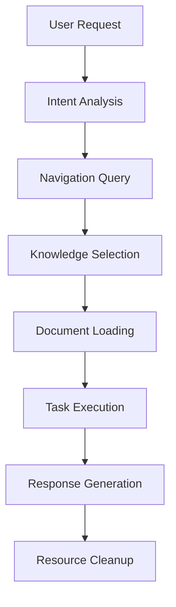

# Buddy AI Technical Architecture V2

## Overview

Buddy AI operates on a **"just-in-time" knowledge model** that dynamically retrieves and loads specific knowledge when needed, rather than maintaining a static knowledge base in memory. This document defines the technical implementation of this system.

## Core System Components

### 1. Knowledge Index System
- **Primary Index**: `projects/buddy-ai/navigation/navigation.json`
- **Structure**: Hierarchical JSON mapping of all project knowledge
- **Access Pattern**: Direct file system queries for rapid lookup
- **Update Mechanism**: Manual updates with validation workflows

### 2. Dynamic Knowledge Retrieval Engine
```
User Request → Query Analysis → Index Consultation → Knowledge Loading → Task Execution
```

**Process Flow:**
1. **Request Analysis**: Parse user intent and identify required knowledge domains
2. **Index Consultation**: Query navigation.json to locate relevant documents
3. **Selective Loading**: Load only the specific documents needed for the task
4. **Context Management**: Maintain focused working memory with minimal overhead
5. **Task Execution**: Process with loaded knowledge, then release resources

### 3. Security Layer
- **API Key Detection**: Real-time scanning of all file operations
- **Automatic Protection**: Immediate .gitignore addition for sensitive files
- **Validation Gates**: Pre-commit hooks and content scanning
- **Audit Trail**: Logging of all security actions taken

## Technical Implementation Details

### Knowledge Storage Architecture
```
projects/buddy-ai/
├── navigation/
│   ├── navigation.json         # Primary index (master source of truth)
│   └── README.md              # Human-readable navigation guide
├── commands/                   # Atomic command definitions
├── buddy-workflows/           # Multi-step procedure definitions  
├── examples/                  # Code templates and patterns
├── fixes/                     # Troubleshooting knowledge
├── tools/                     # External service integration docs
└── best-pratice/             # Development guidelines and standards
```

### Data Flow Patterns

#### 1. Request Processing Pipeline


#### 2. Knowledge Retrieval Optimization
- **Lazy Loading**: Documents loaded only when referenced
- **Context Limits**: Maximum working memory to prevent bloat
- **Caching Strategy**: Recently accessed documents cached temporarily
- **Garbage Collection**: Automatic cleanup of unused knowledge

### Integration Points

#### External Services
- **Fabric AI** (`fabric-ai.rohi.life`): Advanced AI processing and analysis
- **Firecrawl** (`firecrawl.rohi.life`): Web content extraction and processing
- **SearxNG** (`searxng.rohi.life`): Privacy-focused search aggregation

#### Authentication & Security
- **Environment Variables**: API keys stored in `.env` files (gitignored)
- **Service Discovery**: Dynamic endpoint resolution
- **Rate Limiting**: Built-in throttling to prevent abuse
- **Error Handling**: Graceful degradation when services unavailable

## Performance Characteristics

### Scalability Metrics
- **Index Query Time**: < 10ms for navigation.json lookups
- **Document Loading**: < 100ms for typical knowledge documents
- **Memory Footprint**: Dynamic, scales with active task complexity
- **Concurrent Operations**: Stateless design supports multiple simultaneous tasks

### Bottleneck Analysis
1. **Navigation.json Size**: Linear growth with project complexity
   - **Mitigation**: Hierarchical structure, selective loading
2. **File System I/O**: Document reading overhead
   - **Mitigation**: SSD storage, caching frequently accessed files
3. **Context Switching**: Loading/unloading knowledge overhead
   - **Mitigation**: Smart prefetching, context reuse

## Security Architecture

### Threat Model
- **Credential Exposure**: API keys accidentally committed to git
- **Unauthorized Access**: Sensitive project information disclosure
- **Service Abuse**: External service rate limiting and costs

### Protection Mechanisms
```
Input Scanning → Content Analysis → Automatic Protection → User Notification
```

#### 1. Real-time Scanning
- **Pattern Detection**: Regex patterns for common secret formats
- **File Type Analysis**: Special handling for .env, .json, .yml files
- **Context Awareness**: Understanding of different file purposes

#### 2. Automatic Protection
- **Immediate .gitignore**: Files added before git staging
- **Cache Removal**: `git rm --cached` for already-tracked files
- **Backup Creation**: Safety copies before protection actions

#### 3. Audit & Monitoring
- **Action Logging**: All security actions recorded
- **User Notification**: Clear communication of protection taken
- **Validation Reports**: Regular security posture assessments

## Development Workflow Integration

### CI/CD Pipeline
```
Code Change → Security Scan → Navigation Update → Documentation Sync → Deployment
```

#### 1. Pre-commit Hooks
- Navigation validation
- Security scanning
- Documentation consistency checks

#### 2. Automated Testing
- Navigation completeness validation
- Knowledge document accessibility
- Security protection effectiveness

#### 3. Deployment Automation
- Service health checks
- Configuration validation
- Rollback procedures

## Future Architecture Considerations

### Scalability Enhancements
- **Distributed Index**: Multiple navigation files for large projects
- **Content Caching**: Redis/Memcached for frequently accessed knowledge
- **Async Processing**: Non-blocking I/O for large document operations

### Intelligence Improvements
- **Semantic Search**: Vector embeddings for content discovery
- **Predictive Loading**: ML-based prefetching of likely needed knowledge
- **Auto-categorization**: AI-assisted organization of new content

### Integration Expansions
- **Plugin Architecture**: Third-party knowledge source integration
- **API Gateway**: RESTful interface for external tool integration
- **Event Streaming**: Real-time knowledge updates and synchronization

## Monitoring & Observability

### Key Metrics
- Knowledge retrieval latency
- Cache hit rates
- Security action frequency
- User task completion rates
- System resource utilization

### Alerting
- Failed knowledge retrievals
- Security threats detected
- Service availability issues
- Performance degradation

### Debugging
- Request trace logging
- Knowledge loading timelines
- Error context preservation
- Performance profiling tools

---

**Last Updated**: August 5, 2025  
**Version**: 2.0  
**Status**: Implementation Specification
